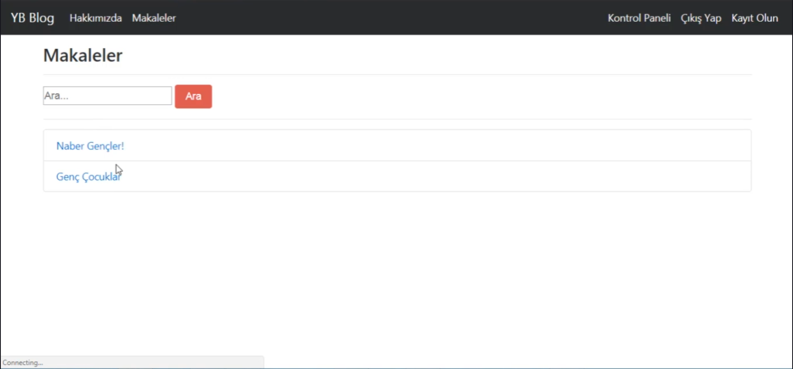
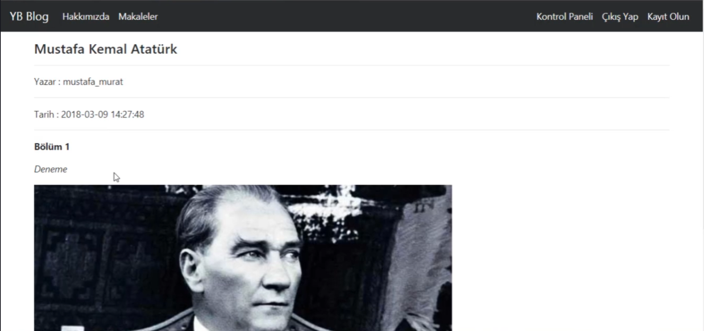
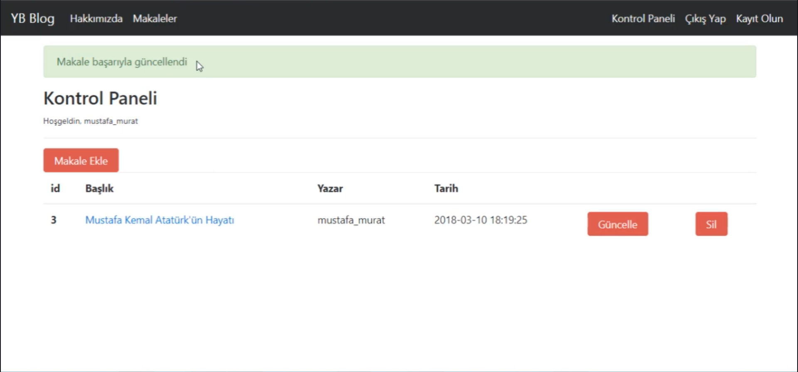

# 📰 Flask Article System Prototype — Article Management System • (Archived)

## 📌 Project Overview
A simple **article management system** built with **Python (Flask)**.  
Users can create, delete, and browse articles, while administrators can manage the platform through a dashboard.  
Developed by following Mustafa Murat Coşkun’s *Python | Sıfırdan İleri Seviye Programlama (2020)* Udemy course as a learning project.  
> 📦 Archived — This project is no longer being updated. It’s kept as part of my learning history and serves as a technical reference for future projects.

 

## 🖼️ Screenshots
Shown below in order:  
**1. Articles** · **2. Article Detail** · **3. Dashboard**

  
  
  

 

## 🧰 Tech Stack

  
  
  
  
  

 

## 📜 License

This project is licensed under the terms described in the [LICENSE](./LICENSE) file.

---

© 2025 Yusuf Okan Sirkeci — [Hereetria](https://github.com/Hereetria)
